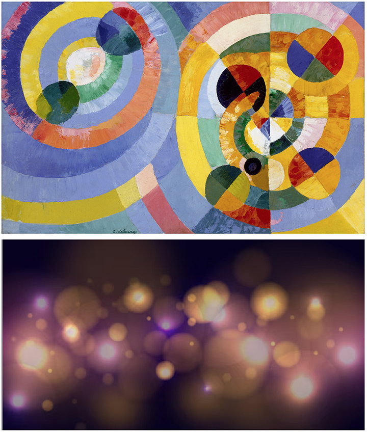

# Geometric Abstraction - Orphism
Orphism in the context of Paris from 1910 to 1930 refers to an avant-garde movement in visual art, particularly in painting, that emerged as a branch of Cubism. Robert and Sonia Delaunay were the leaders of this movement, with other artists such as František Kupka and Jean Metzinger also associated with Orphism. The movement was a reaction to the fragmentation of form in Cubism, and instead, ```it explored how colors could suggest movement, rhythm, and life itself.```
- Use of Color: Orphism emphasized color as the primary means of expression, diverging from Cubism’s focus on form and structure. The Delaunays were particularly interested in the effects of color, and how it could convey motion, light, and energy. The Delaunays were particularly interested in the effects of color, and how it could convey motion, light, and energy.
- Geometry and Abstraction: Although Orphism focuses more on the expression of color, artists still use geometric shapes as the core of their visual language, integrating elements of abstraction and Cubism. Orphism's abstraction was not purely geometric like in Cubism. The shapes were fluid and dynamic, often designed to convey the idea of ​​motion and light rather than just static, fragmented views of objects.
- Light and Movement: Orphism artists try to capture the flow of movement and time through the flow and transformation of colors. Unlike other modernist schools, Orphism emphasizes the movement and vitality in the picture, not just static geometric forms. One of the central ideas behind Orphism was the exploration of light and color's interplay, with artists striving to depict the energy and dynamism of the modern world. They were influenced by the new technological advancements and the industrial environment of the time, which gave rise to new ideas of speed and motion.
- Relationship between works and light: Orphism artists explore the reflection of light and the interaction of colors in their paintings, trying to express the dynamics and changes of objects through these elements, creating a more immersive visual experience.
- Centrifugal Force and Rhythmic Forms: The works in Orphism often included circular forms and motifs meant to suggest motion and vibration, often resembling the dynamic, energetic quality of modern life (like cars, trains, or cityscapes).
## Representing artists and works
- Color and gradient tones are used to express the propagation and movement of light and simulate the reflection and refraction of light
- Circular and spiral patterns show the bending and diffusion of light
- Layout in a rotating or wavy manner simulates the changes of light on different surfaces and spaces
- Transparent color stacking effects show different intensities and textures of light
- Color segmentation and fragmentation effects simulate the constant change, jumping, and fission of light, creating a dynamic visual experience
### Circular Forms Robert Delaunay

### Windows of Paris Robert Delaunay


