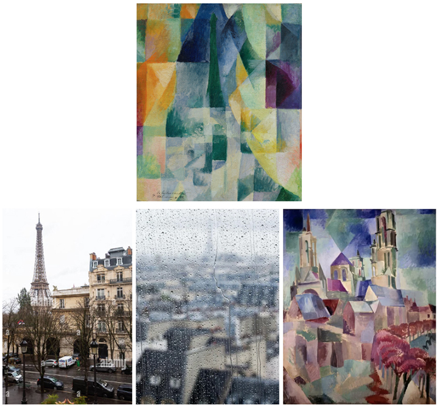

# Geometric Abstraction - Orphism
Orphism in the context of Paris from 1910 to 1930 refers to an avant-garde movement in visual art, particularly in painting, that emerged as a branch of Cubism. Robert and Sonia Delaunay were the leaders of this movement, with other artists such as František Kupka and Jean Metzinger also associated with Orphism. The movement was a reaction to the fragmentation of form in Cubism, and instead, ```it explored how colors could suggest movement, rhythm, and life itself.```
- Use of Color: Orphism emphasized color as the primary means of expression, diverging from Cubism’s focus on form and structure. The Delaunays were particularly interested in the effects of color, and how it could convey motion, light, and energy.
- Abstract Forms: While still maintaining some connection to Cubism, Orphism's abstraction was not purely geometric like in Cubism. The shapes were fluid and dynamic, often designed to convey the idea of motion and light rather than just static, fragmented views of objects.
- Interest in Light: One of the central ideas behind Orphism was the exploration of light and color's interplay, with artists striving to depict the energy and dynamism of the modern world. They were influenced by the new technological advancements and the industrial environment of the time, which gave rise to new ideas of speed and motion.
- Centrifugal Force and Rhythmic Forms: The works in Orphism often included circular forms and motifs meant to suggest motion and vibration, often resembling the dynamic, energetic quality of modern life (like cars, trains, or cityscapes).

